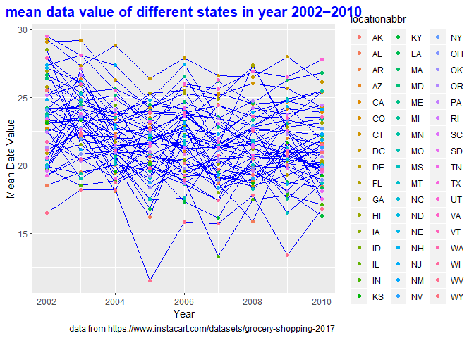
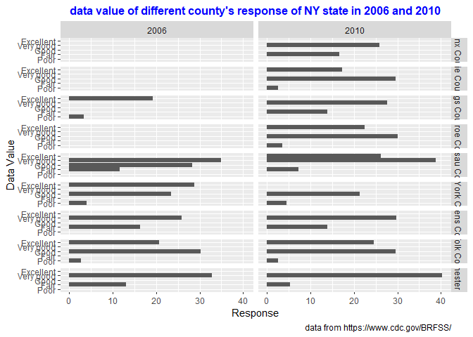
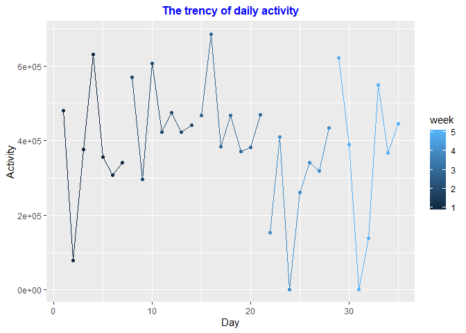
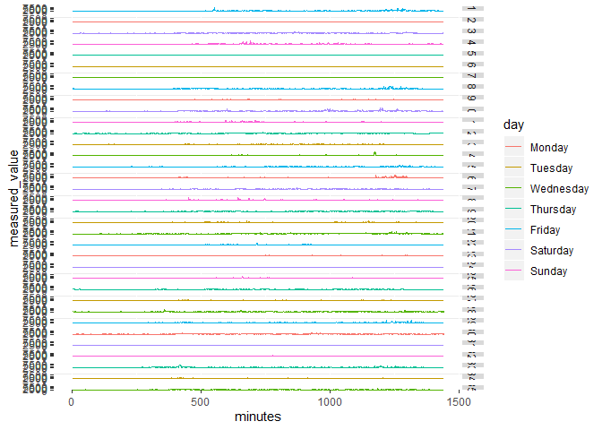

p8105\_hw3\_yh
================
Yongmei Huang
10/9/2019

# Problem 1

## Figure out the total aisles number and important production of each aisles

    ## 108695344 bytes

    ## Classes 'tbl_df', 'tbl' and 'data.frame':    1384617 obs. of  15 variables:
    ##  $ order_id              : int  1 1 1 1 1 1 1 1 36 36 ...
    ##  $ product_id            : int  49302 11109 10246 49683 43633 13176 47209 22035 39612 19660 ...
    ##  $ add_to_cart_order     : int  1 2 3 4 5 6 7 8 1 2 ...
    ##  $ reordered             : int  1 1 0 0 1 0 0 1 0 1 ...
    ##  $ user_id               : int  112108 112108 112108 112108 112108 112108 112108 112108 79431 79431 ...
    ##  $ eval_set              : chr  "train" "train" "train" "train" ...
    ##  $ order_number          : int  4 4 4 4 4 4 4 4 23 23 ...
    ##  $ order_dow             : int  4 4 4 4 4 4 4 4 6 6 ...
    ##  $ order_hour_of_day     : int  10 10 10 10 10 10 10 10 18 18 ...
    ##  $ days_since_prior_order: int  9 9 9 9 9 9 9 9 30 30 ...
    ##  $ product_name          : chr  "Bulgarian Yogurt" "Organic 4% Milk Fat Whole Milk Cottage Cheese" "Organic Celery Hearts" "Cucumber Kirby" ...
    ##  $ aisle_id              : int  120 108 83 83 95 24 24 21 2 115 ...
    ##  $ department_id         : int  16 16 4 4 15 4 4 16 16 7 ...
    ##  $ aisle                 : chr  "yogurt" "other creams cheeses" "fresh vegetables" "fresh vegetables" ...
    ##  $ department            : chr  "dairy eggs" "dairy eggs" "produce" "produce" ...
    ##  - attr(*, "spec")=
    ##   .. cols(
    ##   ..   order_id = col_integer(),
    ##   ..   product_id = col_integer(),
    ##   ..   add_to_cart_order = col_integer(),
    ##   ..   reordered = col_integer(),
    ##   ..   user_id = col_integer(),
    ##   ..   eval_set = col_character(),
    ##   ..   order_number = col_integer(),
    ##   ..   order_dow = col_integer(),
    ##   ..   order_hour_of_day = col_integer(),
    ##   ..   days_since_prior_order = col_integer(),
    ##   ..   product_name = col_character(),
    ##   ..   aisle_id = col_integer(),
    ##   ..   department_id = col_integer(),
    ##   ..   aisle = col_character(),
    ##   ..   department = col_character()
    ##   .. )

    ##     order_id         product_id    add_to_cart_order   reordered     
    ##  Min.   :      1   Min.   :    1   Min.   : 1.000    Min.   :0.0000  
    ##  1st Qu.: 843370   1st Qu.:13380   1st Qu.: 3.000    1st Qu.:0.0000  
    ##  Median :1701880   Median :25298   Median : 7.000    Median :1.0000  
    ##  Mean   :1706298   Mean   :25556   Mean   : 8.758    Mean   :0.5986  
    ##  3rd Qu.:2568023   3rd Qu.:37940   3rd Qu.:12.000    3rd Qu.:1.0000  
    ##  Max.   :3421070   Max.   :49688   Max.   :80.000    Max.   :1.0000  
    ##     user_id         eval_set          order_number      order_dow    
    ##  Min.   :     1   Length:1384617     Min.   :  4.00   Min.   :0.000  
    ##  1st Qu.: 51732   Class :character   1st Qu.:  6.00   1st Qu.:1.000  
    ##  Median :102933   Mode  :character   Median : 11.00   Median :3.000  
    ##  Mean   :103113                      Mean   : 17.09   Mean   :2.701  
    ##  3rd Qu.:154959                      3rd Qu.: 21.00   3rd Qu.:5.000  
    ##  Max.   :206209                      Max.   :100.00   Max.   :6.000  
    ##  order_hour_of_day days_since_prior_order product_name      
    ##  Min.   : 0.00     Min.   : 0.00          Length:1384617    
    ##  1st Qu.:10.00     1st Qu.: 7.00          Class :character  
    ##  Median :14.00     Median :15.00          Mode  :character  
    ##  Mean   :13.58     Mean   :17.07                            
    ##  3rd Qu.:17.00     3rd Qu.:30.00                            
    ##  Max.   :23.00     Max.   :30.00                            
    ##     aisle_id     department_id      aisle            department       
    ##  Min.   :  1.0   Min.   : 1.00   Length:1384617     Length:1384617    
    ##  1st Qu.: 31.0   1st Qu.: 4.00   Class :character   Class :character  
    ##  Median : 83.0   Median : 8.00   Mode  :character   Mode  :character  
    ##  Mean   : 71.3   Mean   : 9.84                                        
    ##  3rd Qu.:107.0   3rd Qu.:16.00                                        
    ##  Max.   :134.0   Max.   :21.00

    ## # A tibble: 8 x 15
    ##   order_id product_id add_to_cart_ord~ reordered user_id eval_set
    ##      <int>      <int>            <int>     <int>   <int> <chr>   
    ## 1        1      49302                1         1  112108 train   
    ## 2        1      11109                2         1  112108 train   
    ## 3        1      10246                3         0  112108 train   
    ## 4        1      49683                4         0  112108 train   
    ## 5        1      43633                5         1  112108 train   
    ## 6        1      13176                6         0  112108 train   
    ## 7        1      47209                7         0  112108 train   
    ## 8        1      22035                8         1  112108 train   
    ## # ... with 9 more variables: order_number <int>, order_dow <int>,
    ## #   order_hour_of_day <int>, days_since_prior_order <int>,
    ## #   product_name <chr>, aisle_id <int>, department_id <int>, aisle <chr>,
    ## #   department <chr>

Dataset instacart has a size of 108695344 byte , about 103.66MB. It
contains 1384617 observations and 15 variables, including order\_id,
product\_id, add\_to\_cart\_order, reordered, user\_id, eval\_set,
order\_number, order\_dow, order\_hour\_of\_day,
days\_since\_prior\_order, product\_name, aisle\_id, department\_id and
aisle. As an example, the first order (order\_id = 1, user\_id = 112108)
includes 8 products (product\_id), and the sequence of adding the
products to the cart was label from 1 to 8. Among all of 8 orders, 4 of
them were reorded and 4 were first ordered. The evaluation set was at
the train. It was thursday 10am when the products were placed into
orders.Days since prior order to current order was 9 days. Theight
products include Yogurt, organic 4% milk fat whole milk cottage cheese,
celery hearts, cucumber, sardines, bananas, avocado, and the whole
string cheese.

    ## # A tibble: 134 x 2
    ##    aisle                         aisle_count
    ##    <chr>                               <int>
    ##  1 fresh vegetables                   150609
    ##  2 fresh fruits                       150473
    ##  3 packaged vegetables fruits          78493
    ##  4 yogurt                              55240
    ##  5 packaged cheese                     41699
    ##  6 water seltzer sparkling water       36617
    ##  7 milk                                32644
    ##  8 chips pretzels                      31269
    ##  9 soy lactosefree                     26240
    ## 10 bread                               23635
    ## # ... with 124 more rows

There are 134 aisles, and the top 3 aisles is “fresh vegetables”, “fresh
fruits” and “packaged vegetables fruits” with the ordered items of
150609, 150473 and 78493, respectively.

## A plot to show the ordered number in each aisles which ordered times \> 10000

<!-- -->

## A table to show top3 popular productions in 3 aisles

|           aisle            |                 product\_name                 | production\_order\_times |
| :------------------------: | :-------------------------------------------: | :----------------------: |
|     baking ingredients     |               Light Brown Sugar               |           499            |
|     baking ingredients     |               Pure Baking Soda                |           387            |
|     baking ingredients     |                  Cane Sugar                   |           336            |
|       dog food care        | Snack Sticks Chicken & Rice Recipe Dog Treats |            30            |
|       dog food care        |      Organix Chicken & Brown Rice Recipe      |            28            |
|       dog food care        |              Small Dog Biscuits               |            26            |
| packaged vegetables fruits |             Organic Baby Spinach              |           9784           |
| packaged vegetables fruits |              Organic Raspberries              |           5546           |
| packaged vegetables fruits |              Organic Blueberries              |           4966           |

top3 popular production in 3 aisles

## A table to show order time of 2 items in each day

|  production\_name  | Sun | Mon | Tue | Wed | Thu | Fri | Sat |
| :----------------: | :-: | :-: | :-: | :-: | :-: | :-: | :-: |
| coffee\_ice\_cream | 14  | 14  | 15  | 15  | 15  | 12  | 14  |
| pink\_lady\_apples | 13  | 11  | 12  | 14  | 12  | 13  | 12  |

mean order time of two production on each day of a week

# Problem 2

## Tidy dataset

    ##  Factor w/ 5 levels "Poor","Fair",..: 1 1 1 1 1 1 1 1 1 1 ...

    ## # A tibble: 10 x 23
    ##     year locationabbr locationdesc class topic question response
    ##    <int> <chr>        <chr>        <chr> <chr> <chr>    <fct>   
    ##  1  2010 AL           AL - Jeffer~ Heal~ Over~ How is ~ Poor    
    ##  2  2010 AL           AL - Mobile~ Heal~ Over~ How is ~ Poor    
    ##  3  2010 AL           AL - Tuscal~ Heal~ Over~ How is ~ Poor    
    ##  4  2010 AZ           AZ - Marico~ Heal~ Over~ How is ~ Poor    
    ##  5  2010 AZ           AZ - Pima C~ Heal~ Over~ How is ~ Poor    
    ##  6  2010 AZ           AZ - Pinal ~ Heal~ Over~ How is ~ Poor    
    ##  7  2010 AR           AR - Benton~ Heal~ Over~ How is ~ Poor    
    ##  8  2010 AR           AR - Pulask~ Heal~ Over~ How is ~ Poor    
    ##  9  2010 AR           AR - Washin~ Heal~ Over~ How is ~ Poor    
    ## 10  2010 CA           CA - Alamed~ Heal~ Over~ How is ~ Poor    
    ## # ... with 16 more variables: sample_size <int>, data_value <dbl>,
    ## #   confidence_limit_low <dbl>, confidence_limit_high <dbl>,
    ## #   display_order <int>, data_value_unit <chr>, data_value_type <chr>,
    ## #   data_value_footnote_symbol <chr>, data_value_footnote <chr>,
    ## #   data_source <chr>, class_id <chr>, topic_id <chr>, location_id <chr>,
    ## #   question_id <chr>, respid <chr>, geo_location <chr>

    ## # A tibble: 10 x 23
    ##     year locationabbr locationdesc class topic question response
    ##    <int> <chr>        <chr>        <chr> <chr> <chr>    <fct>   
    ##  1  2002 VT           VT - Chitte~ Heal~ Over~ How is ~ Excelle~
    ##  2  2002 VT           VT - Frankl~ Heal~ Over~ How is ~ Excelle~
    ##  3  2002 VT           VT - Windso~ Heal~ Over~ How is ~ Excelle~
    ##  4  2002 WA           WA - Clark ~ Heal~ Over~ How is ~ Excelle~
    ##  5  2002 WA           WA - King C~ Heal~ Over~ How is ~ Excelle~
    ##  6  2002 WA           WA - Pierce~ Heal~ Over~ How is ~ Excelle~
    ##  7  2002 WA           WA - Snohom~ Heal~ Over~ How is ~ Excelle~
    ##  8  2002 WV           WV - Kanawh~ Heal~ Over~ How is ~ Excelle~
    ##  9  2002 WI           WI - Milwau~ Heal~ Over~ How is ~ Excelle~
    ## 10  2002 WY           WY - Larami~ Heal~ Over~ How is ~ Excelle~
    ## # ... with 16 more variables: sample_size <int>, data_value <dbl>,
    ## #   confidence_limit_low <dbl>, confidence_limit_high <dbl>,
    ## #   display_order <int>, data_value_unit <chr>, data_value_type <chr>,
    ## #   data_value_footnote_symbol <chr>, data_value_footnote <chr>,
    ## #   data_source <chr>, class_id <chr>, topic_id <chr>, location_id <chr>,
    ## #   question_id <chr>, respid <chr>, geo_location <chr>

    ## [1] FALSE

## Show the states which observed more than 7 locations in 2002 and 2010

| year | locationabbr | desc\_total |
| :--: | :----------: | :---------: |
| 2002 |      AZ      |     10      |
| 2002 |      CO      |     20      |
| 2002 |      CT      |     35      |
| 2002 |      DE      |     15      |
| 2002 |      FL      |     35      |
| 2002 |      GA      |     15      |
| 2002 |      HI      |     20      |
| 2002 |      ID      |     10      |
| 2002 |      IL      |     15      |
| 2002 |      IN      |     10      |
| 2002 |      KS      |     15      |
| 2002 |      LA      |     15      |
| 2002 |      MA      |     40      |
| 2002 |      MD      |     30      |
| 2002 |      ME      |     10      |
| 2002 |      MI      |     20      |
| 2002 |      MN      |     20      |
| 2002 |      MO      |     10      |
| 2002 |      NC      |     35      |
| 2002 |      NE      |     15      |
| 2002 |      NH      |     25      |
| 2002 |      NJ      |     40      |
| 2002 |      NV      |     10      |
| 2002 |      NY      |     25      |
| 2002 |      OH      |     20      |
| 2002 |      OK      |     15      |
| 2002 |      OR      |     15      |
| 2002 |      PA      |     50      |
| 2002 |      RI      |     20      |
| 2002 |      SC      |     15      |
| 2002 |      SD      |     10      |
| 2002 |      TN      |     10      |
| 2002 |      TX      |     10      |
| 2002 |      UT      |     25      |
| 2002 |      VT      |     15      |
| 2002 |      WA      |     20      |

States which observed more than 7 locations in 2002

| year | locationabbr | desc\_total |
| :--: | :----------: | :---------: |
| 2010 |      AL      |     15      |
| 2010 |      AR      |     15      |
| 2010 |      AZ      |     15      |
| 2010 |      CA      |     60      |
| 2010 |      CO      |     35      |
| 2010 |      CT      |     25      |
| 2010 |      DE      |     15      |
| 2010 |      FL      |     205     |
| 2010 |      GA      |     20      |
| 2010 |      HI      |     20      |
| 2010 |      IA      |     10      |
| 2010 |      ID      |     30      |
| 2010 |      IL      |     10      |
| 2010 |      IN      |     15      |
| 2010 |      KS      |     20      |
| 2010 |      LA      |     25      |
| 2010 |      MA      |     45      |
| 2010 |      MD      |     60      |
| 2010 |      ME      |     30      |
| 2010 |      MI      |     20      |
| 2010 |      MN      |     25      |
| 2010 |      MO      |     15      |
| 2010 |      MS      |     10      |
| 2010 |      MT      |     15      |
| 2010 |      NC      |     60      |
| 2010 |      ND      |     15      |
| 2010 |      NE      |     50      |
| 2010 |      NH      |     25      |
| 2010 |      NJ      |     95      |
| 2010 |      NM      |     30      |
| 2010 |      NV      |     10      |
| 2010 |      NY      |     45      |
| 2010 |      OH      |     40      |
| 2010 |      OK      |     15      |
| 2010 |      OR      |     20      |
| 2010 |      PA      |     35      |
| 2010 |      RI      |     25      |
| 2010 |      SC      |     35      |
| 2010 |      SD      |     10      |
| 2010 |      TN      |     25      |
| 2010 |      TX      |     80      |
| 2010 |      UT      |     30      |
| 2010 |      VT      |     30      |
| 2010 |      WA      |     50      |
| 2010 |      WY      |     10      |

States which observed more than 7 locations in 2010

    ## # A tibble: 1 x 2
    ## # Groups:   year [1]
    ##    year     n
    ##   <int> <int>
    ## 1  2002    36

    ## # A tibble: 1 x 2
    ## # Groups:   year [1]
    ##    year     n
    ##   <int> <int>
    ## 1  2010    45

In 2002, there are 36 states which observed 7 or more loactions. In
2010, the number of states which observed 7 or more loaction was 45.

## A plot to show mean value during period of each states

<!-- -->

## A two-panel plot to show the distribution of data value of different response in 2006 and 2010

<!-- -->

# Problem 3

## tidy the dataset

    ## Parsed with column specification:
    ## cols(
    ##   .default = col_double(),
    ##   day = col_character()
    ## )

    ## See spec(...) for full column specifications.

    ## Classes 'tbl_df', 'tbl' and 'data.frame':    50400 obs. of  6 variables:
    ##  $ week              : num  1 1 1 1 1 1 1 1 1 1 ...
    ##  $ day_id            : num  1 1 1 1 1 1 1 1 1 1 ...
    ##  $ day               : chr  "Friday" "Friday" "Friday" "Friday" ...
    ##  $ weekday_or_weekend: chr  "weekday" "weekday" "weekday" "weekday" ...
    ##  $ minutes           : int  1 2 3 4 5 6 7 8 9 10 ...
    ##  $ measured_value    : num  88.4 82.2 64.4 70 75 ...

    ##       week       day_id       day            weekday_or_weekend
    ##  Min.   :1   Min.   : 1   Length:50400       Length:50400      
    ##  1st Qu.:2   1st Qu.: 9   Class :character   Class :character  
    ##  Median :3   Median :18   Mode  :character   Mode  :character  
    ##  Mean   :3   Mean   :18                                        
    ##  3rd Qu.:4   3rd Qu.:27                                        
    ##  Max.   :5   Max.   :35                                        
    ##     minutes       measured_value
    ##  Min.   :   1.0   Min.   :   1  
    ##  1st Qu.: 360.8   1st Qu.:   1  
    ##  Median : 720.5   Median :  74  
    ##  Mean   : 720.5   Mean   : 267  
    ##  3rd Qu.:1080.2   3rd Qu.: 364  
    ##  Max.   :1440.0   Max.   :8982

    ## # A tibble: 10 x 6
    ##     week day_id day    weekday_or_weekend minutes measured_value
    ##    <dbl>  <dbl> <chr>  <chr>                <int>          <dbl>
    ##  1     1      1 Friday weekday                  1           88.4
    ##  2     1      1 Friday weekday                  2           82.2
    ##  3     1      1 Friday weekday                  3           64.4
    ##  4     1      1 Friday weekday                  4           70.0
    ##  5     1      1 Friday weekday                  5           75.0
    ##  6     1      1 Friday weekday                  6           66.3
    ##  7     1      1 Friday weekday                  7           53.8
    ##  8     1      1 Friday weekday                  8           47.8
    ##  9     1      1 Friday weekday                  9           55.5
    ## 10     1      1 Friday weekday                 10           43.0

## Total activity of each day

| week | day\_id | day\_activity |
| :--: | :-----: | :-----------: |
|  1   |    1    |   480542.62   |
|  1   |    2    |   78828.07    |
|  1   |    3    |   376254.00   |
|  1   |    4    |   631105.00   |
|  1   |    5    |   355923.64   |
|  1   |    6    |   307094.24   |
|  1   |    7    |   340115.01   |
|  2   |    8    |   568839.00   |
|  2   |    9    |   295431.00   |
|  2   |   10    |   607175.00   |
|  2   |   11    |   422018.00   |
|  2   |   12    |   474048.00   |
|  2   |   13    |   423245.00   |
|  2   |   14    |   440962.00   |
|  3   |   15    |   467420.00   |
|  3   |   16    |   685910.00   |
|  3   |   17    |   382928.00   |
|  3   |   18    |   467052.00   |
|  3   |   19    |   371230.00   |
|  3   |   20    |   381507.00   |
|  3   |   21    |   468869.00   |
|  4   |   22    |   154049.00   |
|  4   |   23    |   409450.00   |
|  4   |   24    |    1440.00    |
|  4   |   25    |   260617.00   |
|  4   |   26    |   340291.00   |
|  4   |   27    |   319568.00   |
|  4   |   28    |   434460.00   |
|  5   |   29    |   620860.00   |
|  5   |   30    |   389080.00   |
|  5   |   31    |    1440.00    |
|  5   |   32    |   138421.00   |
|  5   |   33    |   549658.00   |
|  5   |   34    |   367824.00   |
|  5   |   35    |   445366.00   |

Total activity of each day

## Daily activity trency

<!-- -->

## A plot to show daily activity for each day

<!-- -->
