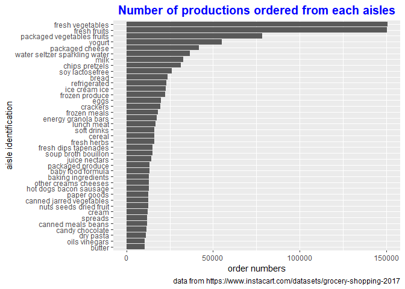

p8105\_hw3\_yh
================
Yongmei Huang
10/9/2019

# Problem 1

``` r
#check the file size of dataset instacart
object.size(instacart)
```

    ## 108695344 bytes

``` r
#review the variable
str(instacart)
```

    ## Classes 'tbl_df', 'tbl' and 'data.frame':    1384617 obs. of  15 variables:
    ##  $ order_id              : int  1 1 1 1 1 1 1 1 36 36 ...
    ##  $ product_id            : int  49302 11109 10246 49683 43633 13176 47209 22035 39612 19660 ...
    ##  $ add_to_cart_order     : int  1 2 3 4 5 6 7 8 1 2 ...
    ##  $ reordered             : int  1 1 0 0 1 0 0 1 0 1 ...
    ##  $ user_id               : int  112108 112108 112108 112108 112108 112108 112108 112108 79431 79431 ...
    ##  $ eval_set              : chr  "train" "train" "train" "train" ...
    ##  $ order_number          : int  4 4 4 4 4 4 4 4 23 23 ...
    ##  $ order_dow             : int  4 4 4 4 4 4 4 4 6 6 ...
    ##  $ order_hour_of_day     : int  10 10 10 10 10 10 10 10 18 18 ...
    ##  $ days_since_prior_order: int  9 9 9 9 9 9 9 9 30 30 ...
    ##  $ product_name          : chr  "Bulgarian Yogurt" "Organic 4% Milk Fat Whole Milk Cottage Cheese" "Organic Celery Hearts" "Cucumber Kirby" ...
    ##  $ aisle_id              : int  120 108 83 83 95 24 24 21 2 115 ...
    ##  $ department_id         : int  16 16 4 4 15 4 4 16 16 7 ...
    ##  $ aisle                 : chr  "yogurt" "other creams cheeses" "fresh vegetables" "fresh vegetables" ...
    ##  $ department            : chr  "dairy eggs" "dairy eggs" "produce" "produce" ...
    ##  - attr(*, "spec")=
    ##   .. cols(
    ##   ..   order_id = col_integer(),
    ##   ..   product_id = col_integer(),
    ##   ..   add_to_cart_order = col_integer(),
    ##   ..   reordered = col_integer(),
    ##   ..   user_id = col_integer(),
    ##   ..   eval_set = col_character(),
    ##   ..   order_number = col_integer(),
    ##   ..   order_dow = col_integer(),
    ##   ..   order_hour_of_day = col_integer(),
    ##   ..   days_since_prior_order = col_integer(),
    ##   ..   product_name = col_character(),
    ##   ..   aisle_id = col_integer(),
    ##   ..   department_id = col_integer(),
    ##   ..   aisle = col_character(),
    ##   ..   department = col_character()
    ##   .. )

``` r
#check the dataset
summary(instacart)
```

    ##     order_id         product_id    add_to_cart_order   reordered     
    ##  Min.   :      1   Min.   :    1   Min.   : 1.000    Min.   :0.0000  
    ##  1st Qu.: 843370   1st Qu.:13380   1st Qu.: 3.000    1st Qu.:0.0000  
    ##  Median :1701880   Median :25298   Median : 7.000    Median :1.0000  
    ##  Mean   :1706298   Mean   :25556   Mean   : 8.758    Mean   :0.5986  
    ##  3rd Qu.:2568023   3rd Qu.:37940   3rd Qu.:12.000    3rd Qu.:1.0000  
    ##  Max.   :3421070   Max.   :49688   Max.   :80.000    Max.   :1.0000  
    ##     user_id         eval_set          order_number      order_dow    
    ##  Min.   :     1   Length:1384617     Min.   :  4.00   Min.   :0.000  
    ##  1st Qu.: 51732   Class :character   1st Qu.:  6.00   1st Qu.:1.000  
    ##  Median :102933   Mode  :character   Median : 11.00   Median :3.000  
    ##  Mean   :103113                      Mean   : 17.09   Mean   :2.701  
    ##  3rd Qu.:154959                      3rd Qu.: 21.00   3rd Qu.:5.000  
    ##  Max.   :206209                      Max.   :100.00   Max.   :6.000  
    ##  order_hour_of_day days_since_prior_order product_name      
    ##  Min.   : 0.00     Min.   : 0.00          Length:1384617    
    ##  1st Qu.:10.00     1st Qu.: 7.00          Class :character  
    ##  Median :14.00     Median :15.00          Mode  :character  
    ##  Mean   :13.58     Mean   :17.07                            
    ##  3rd Qu.:17.00     3rd Qu.:30.00                            
    ##  Max.   :23.00     Max.   :30.00                            
    ##     aisle_id     department_id      aisle            department       
    ##  Min.   :  1.0   Min.   : 1.00   Length:1384617     Length:1384617    
    ##  1st Qu.: 31.0   1st Qu.: 4.00   Class :character   Class :character  
    ##  Median : 83.0   Median : 8.00   Mode  :character   Mode  :character  
    ##  Mean   : 71.3   Mean   : 9.84                                        
    ##  3rd Qu.:107.0   3rd Qu.:16.00                                        
    ##  Max.   :134.0   Max.   :21.00

``` r
#review the first 10 observations
head(instacart, 10)
```

    ## # A tibble: 10 x 15
    ##    order_id product_id add_to_cart_ord~ reordered user_id eval_set
    ##       <int>      <int>            <int>     <int>   <int> <chr>   
    ##  1        1      49302                1         1  112108 train   
    ##  2        1      11109                2         1  112108 train   
    ##  3        1      10246                3         0  112108 train   
    ##  4        1      49683                4         0  112108 train   
    ##  5        1      43633                5         1  112108 train   
    ##  6        1      13176                6         0  112108 train   
    ##  7        1      47209                7         0  112108 train   
    ##  8        1      22035                8         1  112108 train   
    ##  9       36      39612                1         0   79431 train   
    ## 10       36      19660                2         1   79431 train   
    ## # ... with 9 more variables: order_number <int>, order_dow <int>,
    ## #   order_hour_of_day <int>, days_since_prior_order <int>,
    ## #   product_name <chr>, aisle_id <int>, department_id <int>, aisle <chr>,
    ## #   department <chr>

dataset instacart size is 108695344 byte , about 103.66MB. it including
15 variables, 1384617 observations. variables including order\_id,
product\_id, add\_to\_cart\_order, reordered, user\_id, eval\_set,
order\_number, order\_dow, order\_hour\_of\_day,
days\_since\_prior\_order, product\_name, aisle\_id, department\_id and
aisle.

``` r
##aisles counters
aisle_dataset <- instacart %>% 
  janitor::clean_names() %>% 
  group_by(aisle) %>% 
  summarize(
    aisle_count = n()
  ) %>% 
  arrange(desc(aisle_count)) %>%           ##according orderd quantity descending arrange the aisle
  select(aisle, aisle_count)               ##select "aisle" and "aisle_count" variable

aisle_dataset                              ##display the counted aisle
```

    ## # A tibble: 134 x 2
    ##    aisle                         aisle_count
    ##    <chr>                               <int>
    ##  1 fresh vegetables                   150609
    ##  2 fresh fruits                       150473
    ##  3 packaged vegetables fruits          78493
    ##  4 yogurt                              55240
    ##  5 packaged cheese                     41699
    ##  6 water seltzer sparkling water       36617
    ##  7 milk                                32644
    ##  8 chips pretzels                      31269
    ##  9 soy lactosefree                     26240
    ## 10 bread                               23635
    ## # ... with 124 more rows

There are 134 aisles, and the most important top 3 aisles is “fresh
vegetables”, “fresh fruits” and “packaged vegetables fruits”. items
ordered from those top3 aisles is 150609, 150473 and 78493 individuely.

``` r
##plot aisle which ordered item larger than 10000
aisle_dataset %>% 
  filter(aisle_count > 10000) %>% 
  ggplot(aes(x = reorder(aisle, aisle_count), y = aisle_count)) +
  geom_col() +
  coord_flip() +
  labs(
    title = "Number of productions ordered from each aisles",
    x = "aisle identification",
    y = "order numbers",
    caption = "data from https://www.instacart.com/datasets/grocery-shopping-2017"
  ) +
  theme(
    plot.title = element_text(hjust = 0.5, 
                              size = 15, 
                              face = "bold",
                              color = "blue")
  )
```

<!-- -->

``` r
##setup aisle filter factor
aisle_filter_factor <- c("baking ingredients", 
                         "dog food care", 
                         "packaged vegetables fruits")

##selected three most important items in each aisles
three_import_item_dataset <- instacart %>% 
  group_by(
    aisle, product_name
  ) %>%                                                
  summarize(
    production_order_times = n()
  ) %>% 
  filter(aisle %in% aisle_filter_factor) %>%         ##filter 3 aisles
  arrange(desc(production_order_times)) %>%          ##descending ording based on order times
  group_by(aisle) %>% 
  slice(1:3)                                         ##filter the top3 items

knitr::kable(three_import_item_dataset, 
             align = c(rep('c', time = 3)), 
             caption = "top3 popular production in 3 aisles")    ##using a table to display the output
```

|           aisle            |                 product\_name                 | production\_order\_times |
| :------------------------: | :-------------------------------------------: | :----------------------: |
|     baking ingredients     |               Light Brown Sugar               |           499            |
|     baking ingredients     |               Pure Baking Soda                |           387            |
|     baking ingredients     |                  Cane Sugar                   |           336            |
|       dog food care        | Snack Sticks Chicken & Rice Recipe Dog Treats |            30            |
|       dog food care        |      Organix Chicken & Brown Rice Recipe      |            28            |
|       dog food care        |              Small Dog Biscuits               |            26            |
| packaged vegetables fruits |             Organic Baby Spinach              |           9784           |
| packaged vegetables fruits |              Organic Raspberries              |           5546           |
| packaged vegetables fruits |              Organic Blueberries              |           4966           |

top3 popular production in 3
aisles

``` r
##display a table to show the ordered time of two production on each day of the week

##setup the filter factor with "Pink Lady Apples" and "Coffee Ice Cream"
production_filter <- c("Pink Lady Apples", "Coffee Ice Cream")

##based on the production name to calculate the mean order time
mean_order_time <- instacart %>% 
  select(order_dow, order_hour_of_day, product_name) %>% 
  filter(product_name %in% production_filter) %>%        ## filter two items
  group_by(order_dow, product_name) %>% 
  summarize(
    mean_order_hour = round(mean(order_hour_of_day), 
                            digits = 0)
  ) %>%                                                  ##caculate mean oder time of two item
  pivot_wider(
    names_from = "product_name",
    values_from = "mean_order_hour"
  ) %>% 
  mutate(
    day_of_week = wday(order_dow + 1, 
                       label = TRUE) 
  ) %>%                                                  ##add a new col convert number to weekday     
  janitor::clean_names() %>% 
  select(day_of_week, coffee_ice_cream, pink_lady_apples, order_dow) %>% 
  pivot_longer(
    coffee_ice_cream:pink_lady_apples,
    names_to = "production_name",
    values_to = "mean_order_time"
  ) %>%                                                  
  as.tibble()
```

    ## Warning: `as.tibble()` is deprecated, use `as_tibble()` (but mind the new semantics).
    ## This warning is displayed once per session.

``` r
mean_ordered_dataset <- mean_order_time %>% 
  select(day_of_week, production_name, mean_order_time) %>% 
  pivot_wider(
    names_from = "day_of_week",
    values_from = "mean_order_time"
  )

knitr::kable(mean_ordered_dataset, 
             align = c(rep('c', time = 8)), 
             caption = "mean order time of two production on each day of a week")
```

|  production\_name  | Sun | Mon | Tue | Wed | Thu | Fri | Sat |
| :----------------: | :-: | :-: | :-: | :-: | :-: | :-: | :-: |
| coffee\_ice\_cream | 14  | 14  | 15  | 15  | 15  | 12  | 14  |
| pink\_lady\_apples | 13  | 11  | 12  | 14  | 12  | 13  | 12  |

mean order time of two production on each day of a week

# Problem 2

``` r
#tidy the data
##setup health status filter factor
health_status_factor <- c("Poor", "Fair", "Good", "Very good", "Excellent")

##format the dataset, and then filter the data
brfss_dataset <- brfss_smart2010 %>% 
  janitor::clean_names() %>% 
  filter(
    topic == "Overall Health"
  ) %>%                                          ##just select "Overall Health" topic
  filter(
    response %in% health_status_factor
  )                                              ##filter response from "Excellent" to "Poor"

##modify variable response from character to factor and 
##the same time change the order of observation value
brfss_dataset$response <- factor(brfss_dataset$response, 
                                 levels = c("Poor",
                                            "Fair",
                                            "Good",
                                            "Very good",
                                            "Excellent")
                                 )

##ordered response from "Poor" to " Excellent"
brfss_dataset = brfss_dataset[order(brfss_dataset$response, 
                                    decreasing = FALSE), ]

##brfss_dataset$response = order(brfss_dataset$response)

##check point
str(brfss_dataset$response)                       ##response is factor
```

    ##  Factor w/ 5 levels "Poor","Fair",..: 1 1 1 1 1 1 1 1 1 1 ...

``` r
head(brfss_dataset, 10)                           ##check the value of response of head 10 rows
```

    ## # A tibble: 10 x 23
    ##     year locationabbr locationdesc class topic question response
    ##    <int> <chr>        <chr>        <chr> <chr> <chr>    <fct>   
    ##  1  2010 AL           AL - Jeffer~ Heal~ Over~ How is ~ Poor    
    ##  2  2010 AL           AL - Mobile~ Heal~ Over~ How is ~ Poor    
    ##  3  2010 AL           AL - Tuscal~ Heal~ Over~ How is ~ Poor    
    ##  4  2010 AZ           AZ - Marico~ Heal~ Over~ How is ~ Poor    
    ##  5  2010 AZ           AZ - Pima C~ Heal~ Over~ How is ~ Poor    
    ##  6  2010 AZ           AZ - Pinal ~ Heal~ Over~ How is ~ Poor    
    ##  7  2010 AR           AR - Benton~ Heal~ Over~ How is ~ Poor    
    ##  8  2010 AR           AR - Pulask~ Heal~ Over~ How is ~ Poor    
    ##  9  2010 AR           AR - Washin~ Heal~ Over~ How is ~ Poor    
    ## 10  2010 CA           CA - Alamed~ Heal~ Over~ How is ~ Poor    
    ## # ... with 16 more variables: sample_size <int>, data_value <dbl>,
    ## #   confidence_limit_low <dbl>, confidence_limit_high <dbl>,
    ## #   display_order <int>, data_value_unit <chr>, data_value_type <chr>,
    ## #   data_value_footnote_symbol <chr>, data_value_footnote <chr>,
    ## #   data_source <chr>, class_id <chr>, topic_id <chr>, location_id <chr>,
    ## #   question_id <chr>, respid <chr>, geo_location <chr>

``` r
tail(brfss_dataset, 10)                           ##check the value of response of tail 10 rows
```

    ## # A tibble: 10 x 23
    ##     year locationabbr locationdesc class topic question response
    ##    <int> <chr>        <chr>        <chr> <chr> <chr>    <fct>   
    ##  1  2002 VT           VT - Chitte~ Heal~ Over~ How is ~ Excelle~
    ##  2  2002 VT           VT - Frankl~ Heal~ Over~ How is ~ Excelle~
    ##  3  2002 VT           VT - Windso~ Heal~ Over~ How is ~ Excelle~
    ##  4  2002 WA           WA - Clark ~ Heal~ Over~ How is ~ Excelle~
    ##  5  2002 WA           WA - King C~ Heal~ Over~ How is ~ Excelle~
    ##  6  2002 WA           WA - Pierce~ Heal~ Over~ How is ~ Excelle~
    ##  7  2002 WA           WA - Snohom~ Heal~ Over~ How is ~ Excelle~
    ##  8  2002 WV           WV - Kanawh~ Heal~ Over~ How is ~ Excelle~
    ##  9  2002 WI           WI - Milwau~ Heal~ Over~ How is ~ Excelle~
    ## 10  2002 WY           WY - Larami~ Heal~ Over~ How is ~ Excelle~
    ## # ... with 16 more variables: sample_size <int>, data_value <dbl>,
    ## #   confidence_limit_low <dbl>, confidence_limit_high <dbl>,
    ## #   display_order <int>, data_value_unit <chr>, data_value_type <chr>,
    ## #   data_value_footnote_symbol <chr>, data_value_footnote <chr>,
    ## #   data_source <chr>, class_id <chr>, topic_id <chr>, location_id <chr>,
    ## #   question_id <chr>, respid <chr>, geo_location <chr>

``` r
missing(brfss_dataset)
```

    ## [1] FALSE

``` r
##table the states which observed more than 7 loactions in 2002
observed_2002_dataset <- brfss_dataset %>% 
  select(year, locationabbr, locationdesc) %>% 
  group_by(year, locationabbr) %>% 
  summarize(
    desc_total = n()
  ) %>% 
  filter(year == 2002, desc_total >= 7)

knitr::kable(observed_2002_dataset, 
             align = c(rep('c', time = 3)), 
             caption = "States which observed more than 7 locations in 2002")
```

| year | locationabbr | desc\_total |
| :--: | :----------: | :---------: |
| 2002 |      AZ      |     10      |
| 2002 |      CO      |     20      |
| 2002 |      CT      |     35      |
| 2002 |      DE      |     15      |
| 2002 |      FL      |     35      |
| 2002 |      GA      |     15      |
| 2002 |      HI      |     20      |
| 2002 |      ID      |     10      |
| 2002 |      IL      |     15      |
| 2002 |      IN      |     10      |
| 2002 |      KS      |     15      |
| 2002 |      LA      |     15      |
| 2002 |      MA      |     40      |
| 2002 |      MD      |     30      |
| 2002 |      ME      |     10      |
| 2002 |      MI      |     20      |
| 2002 |      MN      |     20      |
| 2002 |      MO      |     10      |
| 2002 |      NC      |     35      |
| 2002 |      NE      |     15      |
| 2002 |      NH      |     25      |
| 2002 |      NJ      |     40      |
| 2002 |      NV      |     10      |
| 2002 |      NY      |     25      |
| 2002 |      OH      |     20      |
| 2002 |      OK      |     15      |
| 2002 |      OR      |     15      |
| 2002 |      PA      |     50      |
| 2002 |      RI      |     20      |
| 2002 |      SC      |     15      |
| 2002 |      SD      |     10      |
| 2002 |      TN      |     10      |
| 2002 |      TX      |     10      |
| 2002 |      UT      |     25      |
| 2002 |      VT      |     15      |
| 2002 |      WA      |     20      |

States which observed more than 7 locations in 2002

``` r
##table the states which observed time more than 7 locations in 2010
observed_2010_dataset <- brfss_dataset %>% 
  select(year, locationabbr, locationdesc) %>% 
  group_by(year, locationabbr) %>% 
  summarize(
    desc_total = n()
  ) %>% 
  filter(year == 2010, desc_total >= 7)

knitr::kable(observed_2010_dataset, 
             align = c(rep('c', time = 3)), 
             caption = "States which observed more than 7 locations in 2010")
```

| year | locationabbr | desc\_total |
| :--: | :----------: | :---------: |
| 2010 |      AL      |     15      |
| 2010 |      AR      |     15      |
| 2010 |      AZ      |     15      |
| 2010 |      CA      |     60      |
| 2010 |      CO      |     35      |
| 2010 |      CT      |     25      |
| 2010 |      DE      |     15      |
| 2010 |      FL      |     205     |
| 2010 |      GA      |     20      |
| 2010 |      HI      |     20      |
| 2010 |      IA      |     10      |
| 2010 |      ID      |     30      |
| 2010 |      IL      |     10      |
| 2010 |      IN      |     15      |
| 2010 |      KS      |     20      |
| 2010 |      LA      |     25      |
| 2010 |      MA      |     45      |
| 2010 |      MD      |     60      |
| 2010 |      ME      |     30      |
| 2010 |      MI      |     20      |
| 2010 |      MN      |     25      |
| 2010 |      MO      |     15      |
| 2010 |      MS      |     10      |
| 2010 |      MT      |     15      |
| 2010 |      NC      |     60      |
| 2010 |      ND      |     15      |
| 2010 |      NE      |     50      |
| 2010 |      NH      |     25      |
| 2010 |      NJ      |     95      |
| 2010 |      NM      |     30      |
| 2010 |      NV      |     10      |
| 2010 |      NY      |     45      |
| 2010 |      OH      |     40      |
| 2010 |      OK      |     15      |
| 2010 |      OR      |     20      |
| 2010 |      PA      |     35      |
| 2010 |      RI      |     25      |
| 2010 |      SC      |     35      |
| 2010 |      SD      |     10      |
| 2010 |      TN      |     25      |
| 2010 |      TX      |     80      |
| 2010 |      UT      |     30      |
| 2010 |      VT      |     30      |
| 2010 |      WA      |     50      |
| 2010 |      WY      |     10      |

States which observed more than 7 locations in 2010

``` r
##statistic the states number of 2002 and 2010
count(observed_2002_dataset)
```

    ## # A tibble: 1 x 2
    ## # Groups:   year [1]
    ##    year     n
    ##   <int> <int>
    ## 1  2002    36

``` r
count(observed_2010_dataset)
```

    ## # A tibble: 1 x 2
    ## # Groups:   year [1]
    ##    year     n
    ##   <int> <int>
    ## 1  2010    45

In 2002, there have 36 states which observed 7 or more loactions. In
2010, the number of states which observed 7 or more loaction was 45.

``` r
##filter the response with "excellent"
exclt_resp_dataset <- brfss_dataset %>% 
  filter(response == "Excellent") %>% 
  select(year, locationabbr, data_value) %>% 
  group_by(year, locationabbr) %>% 
  summarize(
    mean_data_value = mean(data_value, na.rm = TRUE)
  ) 

ggplot(exclt_resp_dataset, aes(x = year, y = mean_data_value)) +
  geom_line(aes(group = locationabbr), color = "blue") +
  geom_point(aes(color = locationabbr)) +
    labs(
    title = "mean data value of different states in year 2002~2010",
    x = "Year",
    y = "Mean Data Value",
    caption = "data from https://www.instacart.com/datasets/grocery-shopping-2017"
  ) +
  theme(
    plot.title = element_text(hjust = 0.5, 
                              size = 15, 
                              face = "bold",
                              color = "blue")
  ) 
```

<!-- -->

``` r
##2006 and 2010 data_value distibution of "Poor", "Fair", "Good", "Very good" and "Excellent"
##filter the dataset to "NY" and year 2006 and 2010
data_value_ny_2006_and_2010 <- brfss_dataset %>% 
  filter(locationabbr == "NY") %>% 
  filter(year == c("2006", "2010")) %>% 
  group_by(locationdesc)
```

    ## Warning in year == c("2006", "2010"): longer object length is not a
    ## multiple of shorter object length

``` r
##delete prefix "NY-"
data_value_ny_2006_and_2010$locationdesc = sapply(strsplit(
  data_value_ny_2006_and_2010$locationdesc, 
  split = "-",
  fixed = TRUE), function(x) (x[2])
)

##draw a two-plane plot which display the
##distribution of data-value in country of NY state
ggplot(data_value_ny_2006_and_2010, aes(x = response, y = data_value)) +     
  geom_col() +                                        
  facet_grid(locationdesc~year) +
  labs(
    title = "data value of different county's response of NY state in 2006 and 2010",
    x = "Data Value",
    y = "Response",
    caption = "data from https://www.cdc.gov/BRFSS/"
  ) +
  theme(
    plot.title = element_text(hjust = 0.5, size = 12, face = "bold", color = "blue")
  ) +
  coord_flip()
```

<!-- -->
